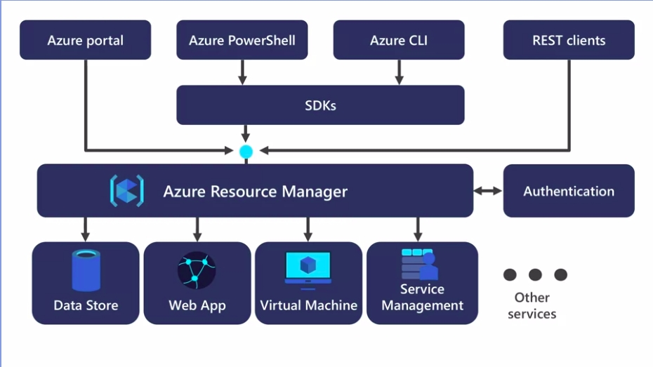
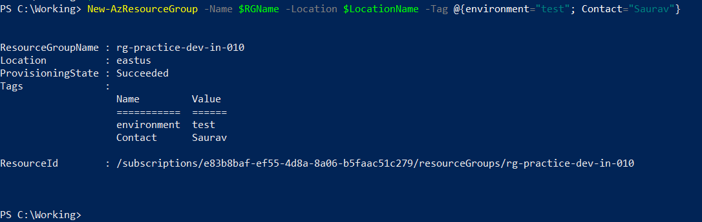
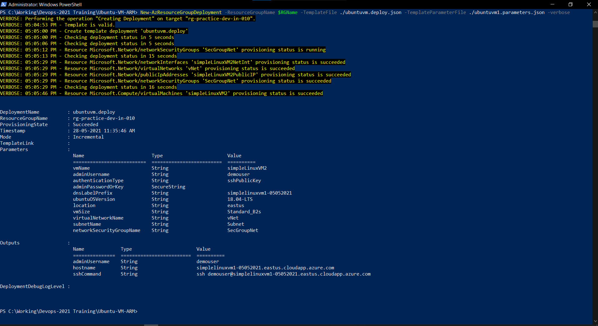
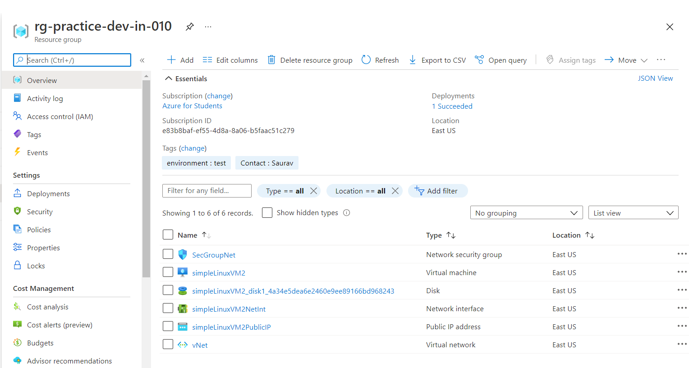

# Deploying Resources using ARM templates and Powershell

## Introduction 

In this project we will be deploying Virtual machine using ARM ( Azure Resource Manager ) Template through Windows Powershell


## What is ARM ?
An **Azure Resource Manager** aka ARM is the deployment and management service for Azure. It provides a management layer that enables us to create, update, and delete resources in the Azure account. 



With the help ARM, azure is able to receive requests from various sources such as Azure Portal, Azure Powershell, CLI or even Rest Clients. Resource Manager also authenticates and authorizes these requests and then the request is sent to the request resource for further process. 

## What is ARM template?
An **ARM template** is a JSON file that defines the infrastructure and configuration for our Resource to be deployed. The template uses declarative syntax. In declarative syntax, you describe your intended deployments without writing the sequence of programming commands to create deployments.


## Why do we need ARM Template?
 - create and deploy an entire Azure infrastructure declaratively. 	
 - resources can be created in orchestrated way
 - Templates can be divided into components 	
 - validation is provided by resource manager to the template before deployment 	
 - We can review the deployment history and get information about the template deployment in the Azure portal 	
 - Templates can be integrated into continuous integration and continuous deployment (CI/CD) tools	


## Look & Feel

### Creating a Resource Group


### Creating Deployments using ARM


### Validating Resource Creation in Portal


## Declaring Variables in Powershell

```powershell
$RGName = "rg-practice-dev-in-010-demo3"
$LocationName = "EastUS"
```

## Create a new Resource Group
```powershell
New-AzResourceGroup -Name $RGName -Location $LocationName -Tag @{environment="test"; Contact="Saurav"}
```

## Deploy the VM
```powershell
New-AzResourceGroupDeployment -ResourceGroupName $RGName -TemplateFile ./ubuntuvm.deploy.json -TemplateParameterFile ./ubuntuvm1.parameters.json -verbose
```

## Validating VMs and resource group creation
```powershell
Get-AzVm
Get-AzResourceGroup | Format-Table
```

## Get Public Ip from resource group
```powershell
$Public_Ip_Address = Get-AzPublicIpAddress -ResourceGroupName $RGName | Select-Object IpAddress
```

## Connecting to the shell using SSH
```powershell
ssh demouser@<Public_Ip_Address>
```
## Installing nginx in Ubuntu VM
```bash
sudo apt-get update 
sudo apt-get install nginx
```
## Exit from VM 
```shell
exit
```

## Visit the website in browser
```browser
http:// $Public_Ip_Address
```

# Refrences

- [Deploy Azure Resources using ARm Teplates and Powershell](https://github.com/Azure/azure-quickstart-templates/tree/master/quickstarts/microsoft.compute/vm-simple-linux)
