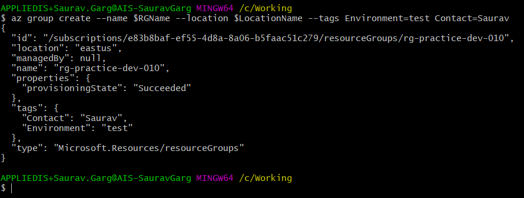
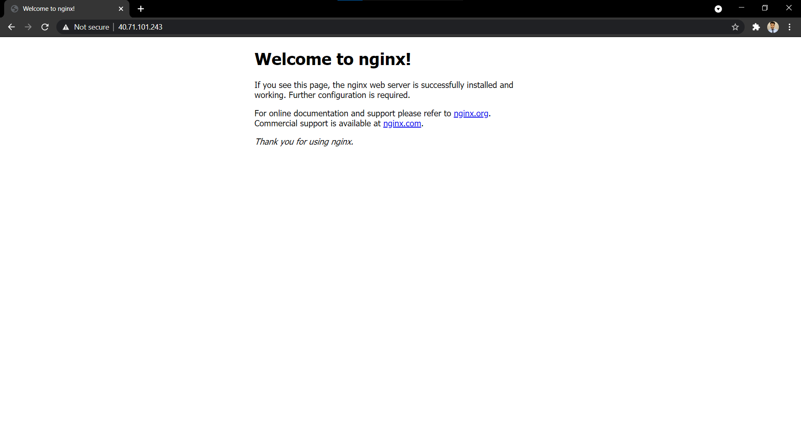

# Create Resources in Azure using Azure CLI

## Introduction
Creating resources from GUI is simple but time consuming. In this demo we will create azure resources using Azure CLI.

## Benefits of using Azure CLI
- Fast.
- Less prone to human errors.
- Can be automated using scripts.

  
<br>  


## Look & Feel






## Generate SSH keys and view the key

```
ssh-keygen -t rsa -b 2048
cat ~/.ssh/id_rsa.pub
```

## Declaring Variables, Creating Resource group and VM

```
RGName="rg-practice-dev-in-010-demo2"
LocationName="EastUS"
BaseName="Vmmay2021"
VmName="ubuntu$BaseName" 
username="demouser"
ImageName="UbuntuLTS" 

az group create --name $RGName --location $LocationName --tags Environment=test Contact=Saurav

az vm create \
    --resource-group $RGName \
    --name $VmName \
    --image $ImageName \
    --admin-username $username \
    --authentication-type ssh --ssh-key-value ~/.ssh/id_rsa.pub
```


## Get Public IP Address & Open port 80

```
publicIp=$(az vm show \
    --resource-group $RGName \
    --name $VmName \
    --show-details \
    --query publicIps \
    --output tsv)

echo $publicIp

az vm open-port --resource-group $RGName --name $VmName --port 80
```

## Connect to the Virtual Machine

```
ssh -i ~/.ssh/id_rsa demouser@$publicIp
```

## Installing Server in the VM

### LAMP Stack
```
sudo apt update && sudo apt install -y lamp-server^
```

### Nginx Server
```
sudo apt-get -y update && sudo apt-get -y install nginx
```

## Check for the installed server

- Visit `http://IpAddress-Of-Newly-Created-VM` from the browser.

<br>

## Appendix

- ## For Help

```
"command" --help

az group create --help
```

- ## Connecting to Azure account

```
az login
```

- ## View All Subscriptions

```
az account show --output table
```

- ## View All Resource groups

```
az group list --output table
```

- ## View All Virtual Machines

```
az vm list
```


- ## Stopping Virtual Machine

```
az vm stop -g $RGName -n $VmName
```

- ## Removing the Resources

    This is important, if you do not need the resources, delete them unless you want all of your credites eaten up.

    - ### Remove Resource group

   ```
   az group delete --name $RGName
   ```
