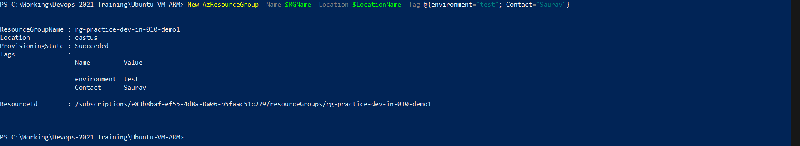
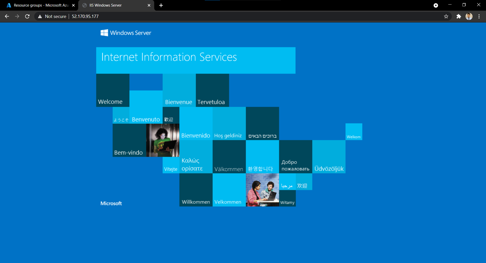

# Create resources using PowerShell


## Introduction
 We can Create resources in Azure in two seperate ways:
 - Using GUI.
 - Using PowerShell or CLI.


## About PowerShell
Windows PowerShell is a command-line shell and scripting language designed especially for system administration.
The Windows PowerShell Integrated Scripting Environment (ISE) is a host application for Windows PowerShell. 
In Windows PowerShell ISE, you can run commands and write, test, and debug scripts in a single Windows-based GUI.

## Benefits of Using Azure PowerShell 

- Manual tasks can be error prone.
- Scripts are used for automation. We can create multiple resources with accuracy, and faster.
- Less Time Consuming.


## Look & Feel






# WorkFlow of PowerShell

## Declaring Variables, Creating Resource group and VM

```
$SubscriptionName = "Azure for Students"
$RGName = "rg-practice-dev-in-010-demo1"
$LocationName = "EastUS"
$BaseName = "may2021win"
$VmName = "vm$($BaseName)"
$VNetName = "vnet$($BaseName)"
$SubNetName = "default"
$NsgName = "nsg$($BaseName)"
$PublicDns = "publicdns$($BaseName)$(Get-Random)"
$PortsToOpen = 80, 3389
$username = 'demouser'
$password = ConvertTo-SecureString 'NoPassword@123$%^&*' -AsPlainText -Force
$ImageName = "Win2019Datacenter" 


New-AzResourceGroup -Name $RGName -Location $LocationName -Tag @{environment="test"; Contact="Saurav"}

$CredentialsForVm = New-Object System.Management.Automation.PSCredential ($username, $password)

New-AzVm -ResourceGroupName $RGName -Name $VmName -Location $LocationName `
    -Credential $CredentialsForVm -Image $ImageName `
    -VirtualNetworkName $VNetName -SubnetName $SubNetName -SecurityGroupName $NsgName `
    -PublicIpAddressName $PublicDns -OpenPorts $PortsToOpen    
```


## Get Public IP Address

```
Get-AzPublicIpAddress `
    -ResourceGroupName $RGName `
    -Name $PublicDns | Select-Object IpAddress
```

## Connect to the VM

### From Windows

```
mstsc /v:publicIpAddress
```

### From Linux or Mac OS

- Download Microsoft Remote Desktop Client.
- Enter the Public IP Address and click connect.

## Installing IIS Server in the VM

- Open PowerShell inside the VM.
- Execute the following command.

```
Install-WindowsFeature -name Web-Server -IncludeManagementTools
```

## Check for the installed server

- Visit `http://IpAddress-Of-Newly-Created-VM` from the browser.


# Appendix


## Basic things


- ## For Help

```
get-help "command"

get-help New-AzResourceGroup
```

- ## Connecting to Azure account and Subscription

```
Connect-AzAccount

Connect-AzAccount -SubscriptionName $SubscriptionName

Set-AzContext -SubscriptionName $SubscriptionName
```

- ## View All Subscriptions

```
Get-AzSubscription
```

- ## View All Resource groups

```
Get-AzResourceGroup
```

- ## View All Virtual Machines

```
Get-AzVm
```
- ## Stopping Virtual Machine

```
Stop-AzVm -Name $VmName -ResourceGroupName $RGName
```

- ## Removing the Resources
```
 This is important, if you do not need the resources, delete them unless you want all of your credites eaten up.
```

- ## Removing VM

```
Remove-AzVM -Name $VmName -ResourceGroupName $RGName
```

- ## Removing Resource group

```
Remove-AzResourceGroup -Name $RGName
```